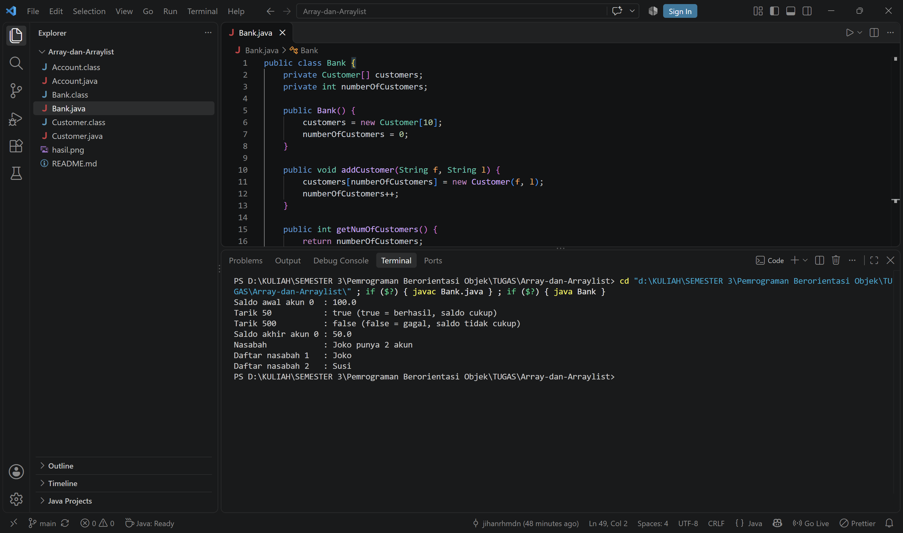

# Array-dan-Arraylist


Nama : Jihan Rahmadani
NIM  : F1D02510060
Kelas: 3B

## Deskripsi

Program sederhana sistem perbankan yang terdiri dari tiga class berelasi
(composition): `Bank` memiliki banyak `Customer`, dan `Customer` memiliki
banyak `Account`. Program ini dibuat untuk latihan penggunaan **array** pada
Java (halaman 26-31 materi PBO 4).

## Struktur File

| File            | Keterangan                                              |
|-----------------|---------------------------------------------------------|
| `Account.java`  | Menyimpan saldo, dengan fungsi setor dan tarik          |
| `Customer.java` | Data nasabah dan array `Account[]` (maksimal 5 akun)    |
| `Bank.java`     | Array `Customer[]` (kapasitas 10) dan method `main`     |

## Penjelasan Class

### Account
- Atribut: `balance` (private, double)
- Constructor: `Account(double init_balance)`
- Method: `getBalance()`, `deposit(double amt)`, `withdraw(double amt)`
- `deposit` mengembalikan `false` jika jumlah <= 0.
- `withdraw` mengembalikan `false` jika saldo tidak cukup.

### Customer
- Atribut: `firstName`, `lastName`, `accounts` (array `Account[5]`), `numberOfAccounts`
- Constructor: `Customer(String f, String l)`
- Method: `getFirstName()`, `getLastName()`, `setAccount(Account acct)`,
  `getAccount(int index)`, `getNumOfAccounts()`
- `setAccount` tidak menambah akun jika array sudah penuh (5 akun).

### Bank
- Atribut: `customers` (array `Customer[10]`), `numberOfCustomers`
- Constructor: `Bank()` membuat array berkapasitas 10
- Method: `addCustomer(String f, String l)`, `getNumOfCustomers()`,
  `getCustomer(int index)`, dan `main` untuk mencoba semua class

## Letak Array

| Lokasi          | Array                            | Kapasitas |
|-----------------|----------------------------------|-----------|
| `Customer.java` | `private Account[] accounts`     | 5         |
| `Bank.java`     | `private Customer[] customers`   | 10        |
| `Bank.java` (`main`) | `Account[] akun`            | 2         |

Variabel `numberOfAccounts` dan `numberOfCustomers` mencatat jumlah slot yang
sudah terisi, sekaligus menunjukkan indeks kosong berikutnya.

## Cara Menjalankan

Pastikan JDK sudah terpasang, lalu jalankan di folder yang berisi file `.java`:

```
javac *.java
java Bank
```

## Isi Method main (di Bank.java)

1. Membuat array `Account[] akun` berisi 2 akun.
2. Menguji `withdraw`: uang cukup (true) dan uang kurang (false).
3. Menguji `Customer`: menambah 2 akun ke satu nasabah.
4. Menguji `Bank`: menambah 2 nasabah lalu menampilkan namanya.

## Hasil Program



## Catatan

- Indeks array dimulai dari 0 dan indeks terakhir yang valid adalah `length - 1`.
- Mengakses indeks di luar rentang akan menimbulkan
  `ArrayIndexOutOfBoundsException`.
- Ukuran array bersifat tetap. Jika ukuran perlu berubah, bisa diganti dengan
  `ArrayList`.